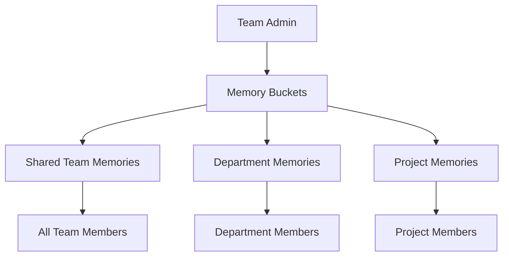

<Note>
MemoryPlugin for Teams and MemoryPlugin for TypingMind Custom are currently under development. If you would like to get early access to this functionality and help shape its development, please contact us.
</Note>

MemoryPlugin can be integrated with TypingMind Custom, a version of TypingMind that is often used by teams or businesses delivering AI-powered experiences to their customers.

## What is TypingMind Custom?

TypingMind Custom is an enterprise version of TypingMind that allows organizations to:
- Deploy custom AI interfaces for their teams
- Provide AI assistance to customers
- Maintain control over AI interactions
- Customize the AI experience for specific use cases

## Benefits for Teams

### Internal Team Use

For internal teams, MemoryPlugin can save time and ensure consistency by providing the ability to:

- **Learn and Recall Business Information**
  - Company policies and procedures
  - Product specifications and details
  - Technical documentation
  - Team member roles and responsibilities

- **Maintain Consistency**
  - Preferred writing style and tone
  - Brand voice and messaging
  - Standard responses to common questions
  - Approved terminology and phrasing

- **Evolving Knowledge Base**
  - Automatically grows over time
  - Learns from team interactions
  - Captures institutional knowledge
  - Preserves expertise even when team members change

### Customer-Facing Applications

For TypingMind Custom instances aimed towards end-users, your AI can:

- **Develop Customer Relationships**
  - Remember customer preferences
  - Track interaction history
  - Personalize responses based on past conversations
  - Build rapport over time

- **Increase Engagement**
  - Every conversation builds on previous ones
  - No need to re-explain context
  - More relevant and helpful responses
  - Better user satisfaction

## How It Works

### Team Memory Architecture

### Memory Sharing Models

<Tabs>
  <Tab title="Centralized">
    All team members share a common memory pool
    - Best for small teams
    - Ensures complete consistency
    - Simple management
  </Tab>
  <Tab title="Hierarchical">
    Memories organized by department/role
    - Scales for larger organizations
    - Department-specific knowledge
    - Role-based access
  </Tab>
  <Tab title="Project-Based">
    Memories grouped by project or client
    - Perfect for agencies
    - Client confidentiality
    - Project isolation
  </Tab>
</Tabs>

## Use Cases

### Customer Support

Transform your customer support with persistent memory:
- Remember customer issues and resolutions
- Track product preferences
- Maintain conversation context across sessions
- Escalate with full history

### Sales Teams

Enhance sales interactions:
- Remember prospect details and pain points
- Track negotiation history
- Maintain relationship context
- Share successful strategies

### Product Development

Accelerate development cycles:
- Capture feature requirements
- Remember technical decisions
- Track bug reports and fixes
- Maintain API documentation

### Marketing Teams

Ensure brand consistency:
- Store brand guidelines
- Remember campaign details
- Track content strategies
- Maintain tone and voice

## Implementation Options

### Standard Integration

Basic TypingMind Custom + MemoryPlugin:
- Individual user memories
- Manual bucket management
- Standard API integration

### Team Integration (Coming Soon)

Enhanced team features:
- Shared team memories
- Admin management console
- Automated memory organization
- Analytics and insights

### Enterprise Integration (Future)

Full enterprise capabilities:
- SSO integration
- Advanced permissions
- Audit logging
- Custom memory policies

## Getting Started

<Steps>
  <Step title="Contact Us">
    Reach out through the MemoryPlugin website or dashboard
  </Step>
  <Step title="Discuss Requirements">
    Share your team size, use case, and requirements
  </Step>
  <Step title="Join Beta Program">
    Get early access to team features
  </Step>
  <Step title="Implementation Support">
    Receive guidance for setup and configuration
  </Step>
</Steps>

## Pricing for Teams

Team pricing is customized based on:
- Number of team members
- Memory storage requirements
- Support level needed
- Custom feature requests

<Card title="Request Team Pricing" icon="envelope" href="mailto:support@memoryplugin.com">
  Contact us for custom team pricing and early access
</Card>

## Security and Compliance

### Data Protection
- End-to-end encryption
- Data isolation between teams
- Regular security audits
- GDPR compliance

### Access Control
- Role-based permissions
- Admin oversight
- Audit trails
- Memory access logs

### Privacy
- No training on your data
- Data ownership retained
- Export capabilities
- Deletion rights

## Comparison with Individual Plans

| Feature | Individual | Teams (Coming) |
|---------|-----------|---------------|
| **Personal Memories** | ✅ | ✅ |
| **Shared Memories** | ❌ | ✅ |
| **Admin Console** | ❌ | ✅ |
| **Team Analytics** | ❌ | ✅ |
| **Priority Support** | ❌ | ✅ |
| **Custom Integration** | Limited | ✅ |
| **SSO** | ❌ | Future |

## Roadmap

### Phase 1: Beta (Current)
- Basic team memory sharing
- Simple admin controls
- TypingMind Custom integration

### Phase 2: General Availability
- Advanced permissions
- Analytics dashboard
- Automated organization

### Phase 3: Enterprise
- SSO and SAML
- Advanced compliance
- Custom deployments

## FAQ

<AccordionGroup>
  <Accordion title="When will team features be available?">
    Team features are currently in development. Contact us for early access and to help shape the feature set.
  </Accordion>
  <Accordion title="Can we migrate from individual accounts?">
    Yes, we'll provide migration tools to consolidate individual accounts into team accounts.
  </Accordion>
  <Accordion title="Is there a minimum team size?">
    We're designing for teams of 3+ members, but contact us to discuss your specific needs.
  </Accordion>
  <Accordion title="Can we self-host?">
    Self-hosting options are being considered for enterprise customers. Express interest when contacting us.
  </Accordion>
</AccordionGroup>

## Benefits Summary

<CardGroup cols={2}>
  <Card title="Knowledge Retention" icon="brain">
    Preserve institutional knowledge even as team members change
  </Card>
  <Card title="Consistency" icon="check-circle">
    Ensure uniform responses and information across all team interactions
  </Card>
  <Card title="Efficiency" icon="rocket">
    Reduce time spent re-explaining context and finding information
  </Card>
  <Card title="Scalability" icon="chart-line">
    Grow your AI capabilities alongside your team
  </Card>
</CardGroup>

## Next Steps

<CardGroup cols={2}>
  <Card
    title="Request Early Access"
    icon="hand"
    href="mailto:support@memoryplugin.com"
  >
    Join the beta program for team features
  </Card>
  <Card
    title="Learn About TypingMind"
    icon="keyboard"
    href="/integrations/typingmind-plugin"
  >
    Understand the TypingMind integration
  </Card>
</CardGroup>